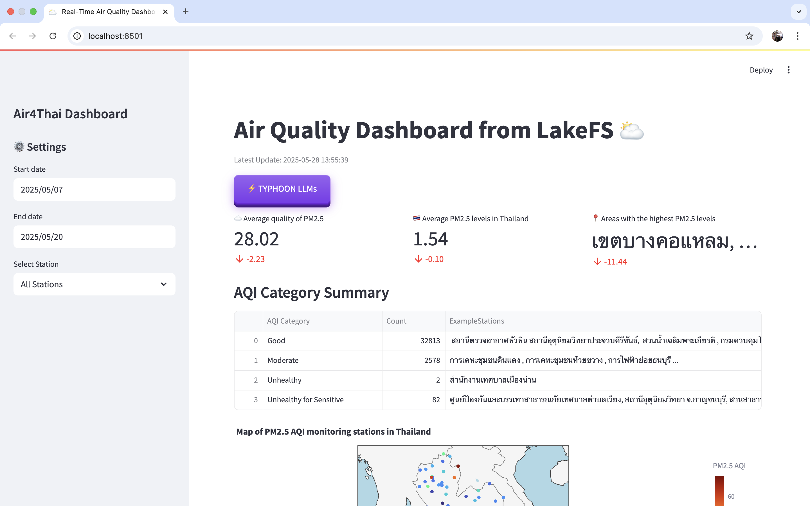
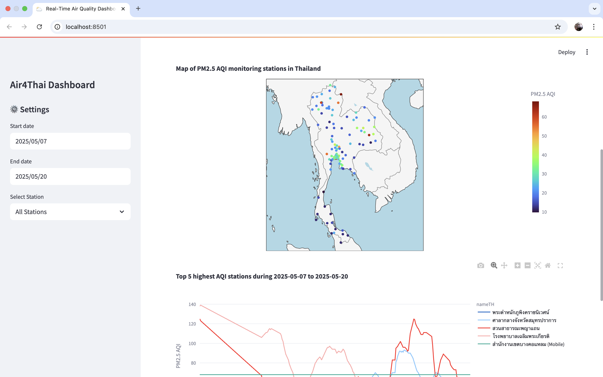
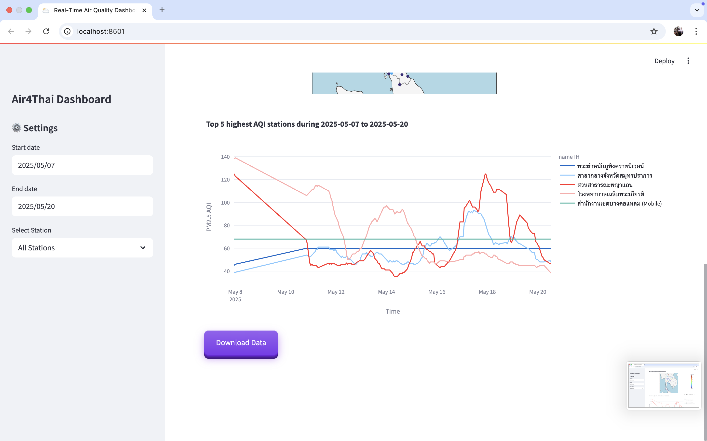

# 🌦️ **Real-Time Air-Quality Data Pipeline with Visualization Project**
## **Subject:** DSI321 Big Data Infrastructure
**Prepared by:** Lapatrada Truktrongkij

## 📌 **Project Overview**
This project is developed as part of the **DSI321: BIG DATA INFRASTRUCTURE** course, aiming to build a real-time air quality monitoring system focused on PM2.5 levels across Thailand. The system collects data from the [**Air4Thai**](http://air4thai.pcd.go.th), processes it through an automated pipeline orchestrated by Prefect, and presents insights through an interactive dashboard built with Streamlit. Key technologies include Docker for containerization, LakeFS for data version control, and Typhoon AI (a large language model) for generating human-readable summaries and insights. The goal is to make PM2.5 data both accessible and actionable for the general public and decision-makers.

### 📖 **Introduction**
Air pollution, particularly fine particulate matter (PM2.5), has emerged as a major environmental and public health concern in Thailand. Prolonged exposure to PM2.5 can lead to serious respiratory and cardiovascular issues. Real-time monitoring of PM2.5 levels is therefore crucial for raising public awareness and informing timely responses.

To support this need, the project implements a fully automated data pipeline that collects PM2.5 data from the **Air4Thai** network—an official source managed by the **Pollution Control Department of Thailand**. The system is designed for scalability, reproducibility, and ease of use by integrating modern data engineering tools.

The pipeline leverages [**Prefect.io**](https://www.prefect.io/) for task scheduling and orchestration, ensuring robust handling of data fetching, cleaning, and transformation. All components are containerized with [**Docker**](https://www.docker.com/) to maintain consistency across environments, and [**LakeFS**](https://lakefs.io/) is used for managing dataset versioning and lifecycle.

To make the output data more user-friendly and insightful, [**Typhoon AI**](https://opentyphoon.ai/), a large language model, is integrated into the system. It automatically generates natural language summaries of air quality trends, detects anomalies, and provides regional highlights bridging the gap between raw data and human interpretation.

The final output is an interactive web-based dashboard built with [**Streamlit**](https://streamlit.io/) that allows users to explore real-time PM2.5 data and receive AI-powered insights, making the system valuable for both public users and environmental analysts.

### 🛠️ **Key Components**

- **Data Collection**: Automated retrieval of hourly PM2.5 data from the Air4Thai API.

- **Data Processing**: Cleaning, transforming, and storing data using Python.

- **Workflow Orchestration**: Prefect handles task scheduling, dependencies, retries, and logging.

- **Containerization**: Docker and Docker Compose manage consistent, modular environments.

- **Data Versioning**: LakeFS tracks and controls dataset changes for reproducibility.

- **Natural Language Summarization**: Typhoon AI generates easy-to-understand air quality summaries.

- **Interactive Dashboard**: Streamlit visualizes real-time PM2.5 data alongside LLM-generated insights.
  
### 🕹️ **Technologies Used**

- **Python**: Backend development, data handling, and orchestration scripts.

- **Prefect**: Automates the flow of tasks within the data pipeline.

- **Docker & Docker Compose**: For consistent multi-container deployments.

- **LakeFS**: Git-like version control for data lifecycle management.

- **Typhoon AI (LLM)**: Provides AI-generated natural language summaries.

- **Streamlit**: Frontend dashboard for real-time, interactive data visualization.
  
### 🎯 **Expected Outcomes**

- A fully automated, real-time PM2.5 monitoring pipeline.

- Interactive Streamlit dashboard for public and expert users.

- AI-powered natural language summaries to enhance data interpretation.

- Reliable, scalable, and version-controlled system architecture.

## 🌈 **Getting Started**
To run it locally:

1. **Clone the Repository**:
  ```bash
   $ git clone <this-repo-url>
   $ cd <this-repo-folder>
  ```
2. **Start Docker Services**:
  ```bash
   $ docker compose up -d --build
  ```
After successful deployment, you can access:\\
Prefect Dashboard : http://localhost:4200\\
JupyterLab : http://localhost:8888\\
LakeFS : http://localhost:8001 (changed from default 8000)\\
Stramlit : http://localhost:8501

3. **Deploy Prefect Flow**:
  ``` bash
    python src/pipeline.py deploy

    # OR via JupyterLab at http://localhost:8888 
    # Start new terminal session
    python deploy.py
  ```

This creates a deployment named ```data-pipeline``` in the ```default-agent-pool``` work pool.

## 📊 **Visualization**: 🌥️ Real-Time Air Quality Dashboard
This **Streamlit** app provides an interactive and real-time dashboard for visualizing air quality data across Thailand. The app reads data directly from **LakeFS via S3**, processes and filters it, then presents users with powerful charts, insights, and an AI-generated analysis using **Typhoon LLMs**.





### 🔑 **Key Features**

- **📊 Real-Time Data Loading** from LakeFS Parquet files via S3
- **🗺️ Geo Mapping**: Interactive map of PM2.5 AQI readings using Plotly
- **📈 Time Series Visualization** for selected or top-5 stations
- **📌 Executive Summary** with AI-generated policy insights via Typhoon LLMs
- **📂 Data Download**: Filter and export the AQI dataset
- **🎛️ Sidebar Filters**: Adjust station and datetime ranges live

### 🗺️ **Visualizations Overview**

| Visualization              | Description                                                  |
| -------------------------- | ------------------------------------------------------------ |
| **KPI Cards**              | At-a-glance stats: average AQI, status color, worst-hit area |
| **Category Table**         | AQI category summary with counts and stations                |
| **Map (Geo Scatter)**      | Plotly map showing average AQI per station across Thailand   |
| **Time Series Line Chart** | AQI trend over time by station or top 5 highest              |
| **Typhoon LLM Summary**    | Auto-generated health/policy analysis using Typhoon/OpenAI   |

## 🗃️ **Data Schema**
The dataset used in this dashboard contains air quality readings enriched with location, time, and AQI-specific information.

``` 
{
  "columns": [
    "timestamp", "stationID", "nameTH", "nameEN", "areaTH",
    "areaEN", "stationType", "lat", "long", "PM25.color_id",
    "PM25.aqi", "year", "month", "day", "hour"
  ],
  "types": [
    "datetime64[ns]", "string", "string", "string", "string", 
    "string", "string", "float64", "float64", "int64",  
    "float64", "int64", "int64", "int32", "int32"
    ],
  "key_columns": [
    "timestamp", "stationID", "nameTH", "nameEN", "areaTH",
    "areaEN", "stationType", "lat", "long", "PM25.color_id",
    "year", "month", "day", "hour"
  ]
} 
```
Key columns are used for data quality checks (no missing values allowed).

### 📋 **Column Descriptions**

| Column Name     | Type             | Description                              |
| --------------- | ---------------- | ---------------------------------------- |
| `timestamp`     | `datetime64[ns]` | Date and time of reading                 |
| `stationID`     | `string`         | Unique ID of the station                 |
| `nameTH`        | `string`         | Station name in Thai                     |
| `nameEN`        | `string`         | Station name in English                  |
| `areaTH`        | `string`         | Area name in Thai                        |
| `areaEN`        | `string`         | Area name in English                     |
| `stationType`   | `string`         | Type of station |
| `lat`           | `float64`        | Latitude of the station                  |
| `long`          | `float64`        | Longitude of the station                 |
| `PM25.color_id` | `int64`          | Color ID for visualization based on PM2.5 level    |
| `PM25.aqi`      | `float64`        | PM2.5 PM2.5 Air Quality Index (AQI)                   |
| `year`          | `int64`          | Year of data record                 |
| `month`         | `int64`          | Month of data record                 |
| `day`           | `int32`          | Day of data record                   |
| `hour`          | `int32`          | Hour of data record                  |


## 🧪 **Example Use Cases**
- Environmental monitoring by agencies.

- Public health trend analysis.

- Citizens checking AQI in their area.

- Data science projects in climate or health domains.